This Genesys Cloud Developer Blueprint explains how to set up a WebRTC phone in CX as Code or Genesys Cloud.

## Solution Components

- Genesys Cloud - a suite of Genesys cloud services for enterprise-grade communications, collaboration, and contact center management.
- [CX as Code](https://developer.genesys.cloud/devapps/cx-as-code/ "Goes to the CX As Code article in the Genesys Cloud Developer Center") - a configuration management tool that allows you to define Genesys Cloud configuration objects (e.g. Queues, Skills, Users, etc) in plain old text files and then apply that configuration across multiple Genesys Cloud organizations. It is ideally suited for use in a CI/CD (Continuous Integration/Continuous Deployment) deployment pipeline. This tool runs in [Terraform](https://www.terraform.io/ "Goes to the Terraform Homepage").

## Prerequisites

- Specialized Knowledge
  - Administrator-level knowledge of Genesys Cloud.
  - Basic knowledge of the Genesys Cloud API.
  - Basic knowledge of Terraform.
- Genesys Account Requirements
  - A Genesys Cloud license. For more information, see [Genesys Cloud Pricing](https://www.genesys.com/pricing "Goes to the Genesys Cloud Pricing page").
  - Master Admin role in Genesys Cloud. For more information, see [Roles and permissions overview](https://help.mypurecloud.com/?p=24360 "Goes to the roles and permissions overview in the Genesys Cloud Resource Center") in the Genesys Cloud Resource Center.
  - [OAuth Client](https://help.mypurecloud.com/articles/create-an-oauth-client/ "Goes to the Create an OAuth Client article") with the Master Admin role _(Optional but recommended for CX as Code)_. You can also create a role with permissions on the following:
    - Directory
    - Telephony

## Implementation Steps

This blueprint has 2 implementation steps that allows you to do this manually via Genesys Cloud or use CX as Code _(which is highly recommended)_.

- [Genesys Cloud](#configuring-in-the-genesys-cloud "Goes to the Configuring in the Genesys Cloud section")
    1. [Create a Location](#create-a-location "Goes to the Create a Location section")
    2. [Create a Site](#create-a-site "Goes to the Create a Site section")
    3. [Create a WebRTC Phone Base Setting](#create-a-webrtc-phone-base-setting "Goes to the Create a WebRTC Phone Base Setting section")
    4. [Create a WebRTC Phone to a specific user](#create-a-webrtc-phone-to-a-specific-user "Goes to the Create a WebRTC Phone to a specific user section")
- [CX as Code](#configuring-in-cx-as-code "Goes to the Configuring in CX as Code section")
    1. [Create an OAuth Client](#create-an-oauth-client)
    2. [Clone the blueprint repository](#clone-the-blueprint-repository "Goes to the Clone the blueprint repository section")
    3. [Setup the Terraform Project](#setup-the-terraform-project "Goes to the Setup the Terraform Project section")
    4. [Setup and configure your Terraform resources](#setup-and-configure-your-terraform-resources "Goes to the Setup and configure your Terraform resources section")
        - [Create a User](#create-a-user "Goes to the Create a User section")*
        - [Create a Location Resource](#create-a-location-resource "Goes to the Create a Location Resource section")*
        - [Create a Site Resource](#create-a-site-resource "Goes to the Create a Site Resource section")*
        - [Create a WebRTC Phone Base Setting Resource](#create-a-webrtc-phone-base-setting-resource "Goes to the Create a WebRTC Phone Base Setting Resource section")*
        - [Create a Phone Resource to a specific user](#create-a-phone-resource-to-a-specific-user "Goes to the Create a Phone Resource to a specific user section")
    5. [Deploy your Terraform Resources](#deploy-your-terraform-resources "Goes to the Deploy your Terraform Resources section")
- [Testing](#testing "Goes to the testing section")

Note: * The following are optional if you already have these resources but recommended to also put it in Terraform.

## Configuring in the Genesys Cloud

### Create a Location

In the **Admin Home**, go to **Directory** > **Locations**. Then, click **Add Location**.

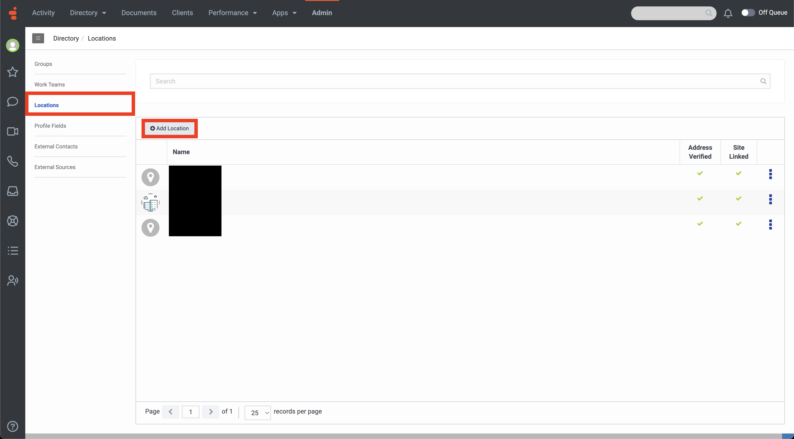

Enter necessary details like **Name** and **Address**. You can also provide a photo and location notes. Once filled up, click **Save**.

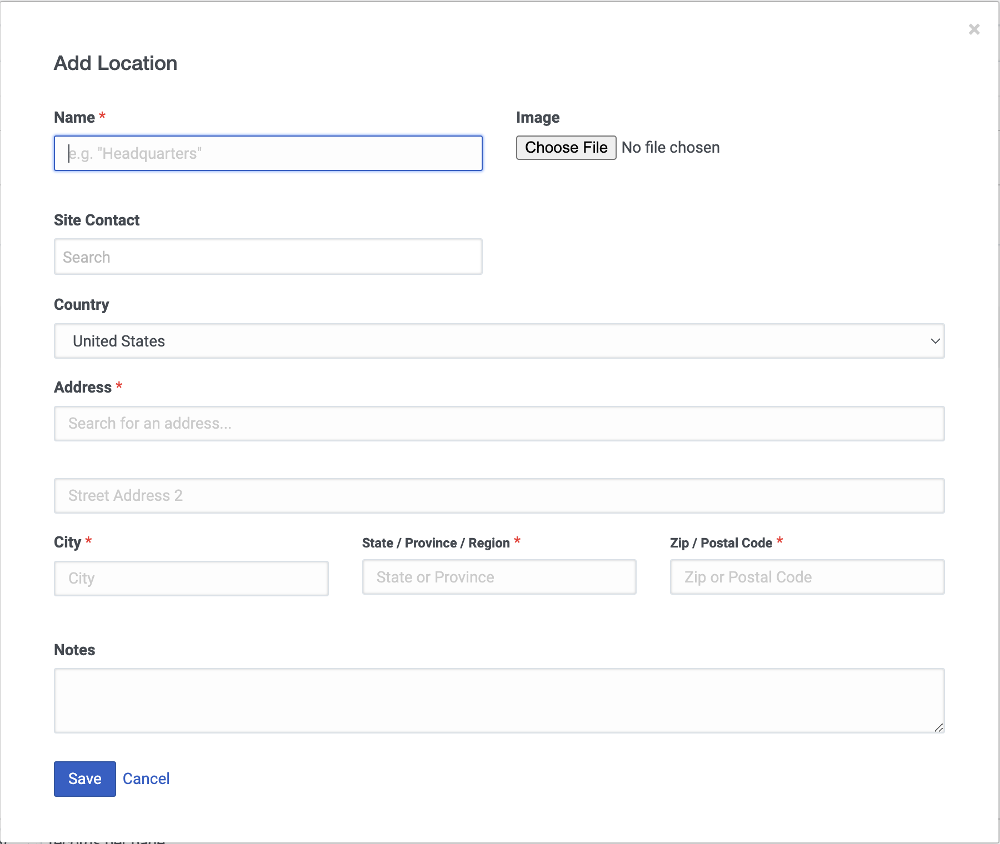

:::primary
Once created, you can also configure additional details on the location like Emergency Numbers, Location Floors, and Assign People.
:::

### Create a Site

In the **Admin Home**, go to **Telephony** > **Sites**. Then, click **Add**.

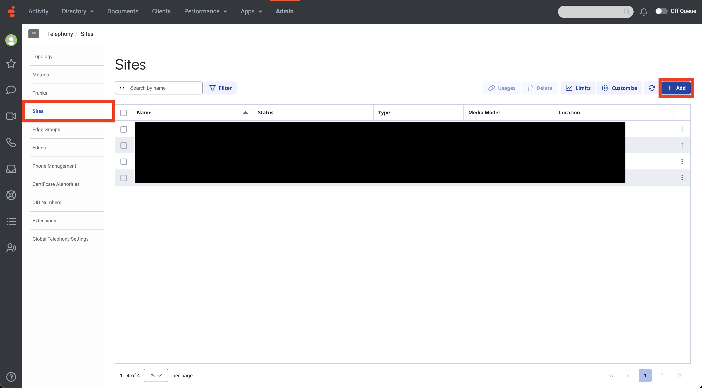

Enter the **Name** and select the **Location** for the site. Select a **Media Type** and the **Time Zone**. Once everything is filled up, click **Create**.

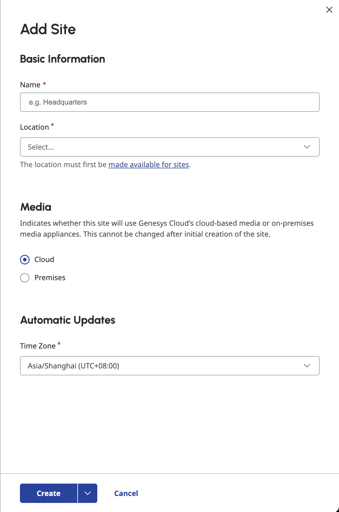

### Create a WebRTC Phone Base Setting

In the **Admin Home**, go to **Telephony** > **Phone Management**. Select **Base Settings** tab, then click **Add**.

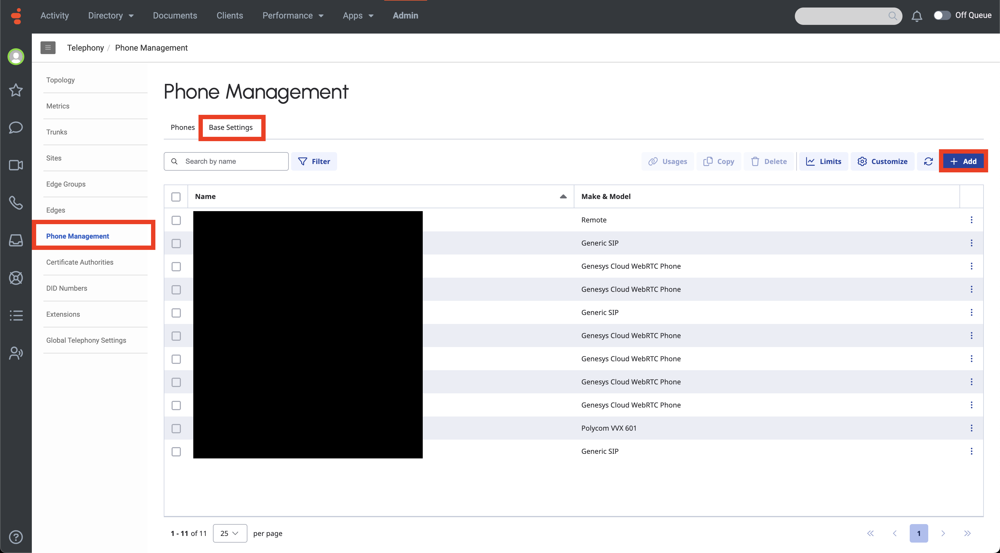

Choose the `Genesys Cloud WebRTC Phone` as the **Phone Make and Model**. From there, add a **Name** to the base setting. From here, you can now configure the settings of the WebRTC phone from persistent connection, TURN configurations, DSCP configurations, signaling, additional attributes, etc. Once configured, click **Save Base Settings**.

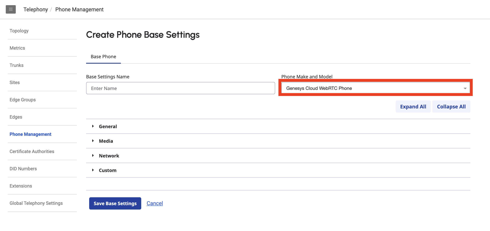

### Create a WebRTC Phone to a specific user

In the **Admin Home**, go to **Telephony** > **Phone Management**. Select **Phones** tab, then click **Add**.

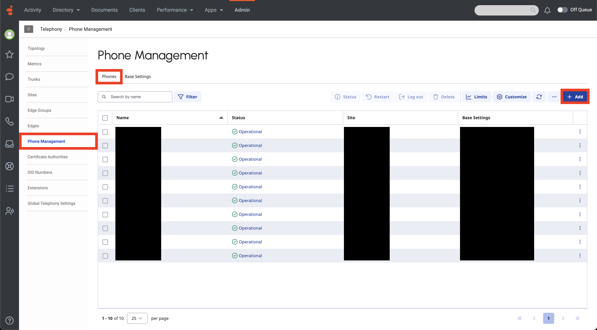

Provide details like **Name**, the Phone **Base Settings** and **Site** you have created, and the **Person** you want the phone to be assigned. You can also provide additional configurations on the user's phone aside from the base settings you have created. Once done, click **Save Phone**.

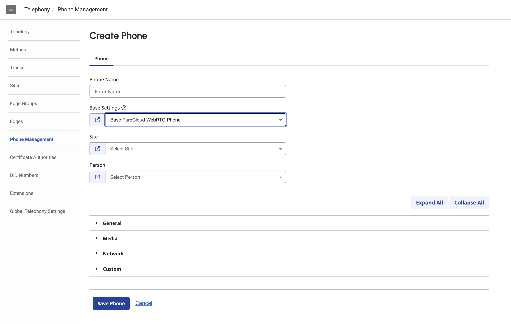

## Configuring in CX as Code

### Create an OAuth Client

In Genesys Cloud Admin, go to **Integrations** > **OAuth**. Then, click **Add Client**.

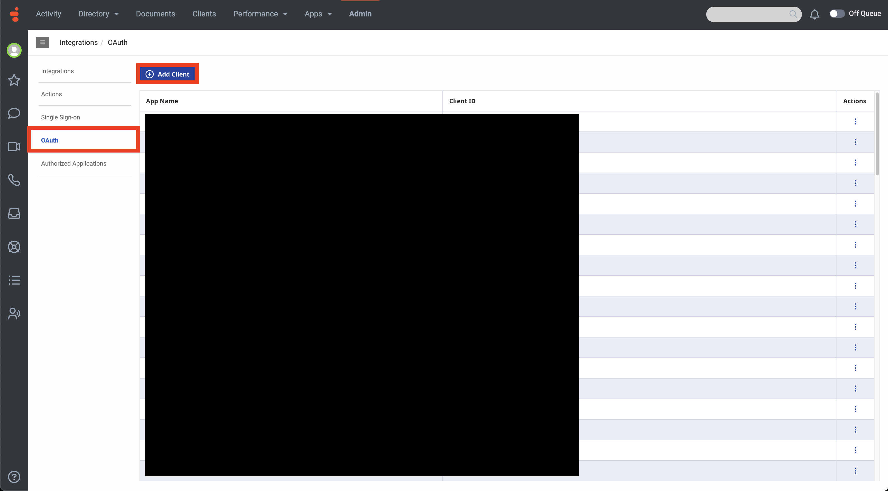

Provide the **Name**, **Description**, and **Token Duration**. Select the `Client Credentials` **Grant Type**. This will ask you to select role/s for this client, which you can select on the **Roles** tab. Once you have assigned a role and provided the details, click **Save**.

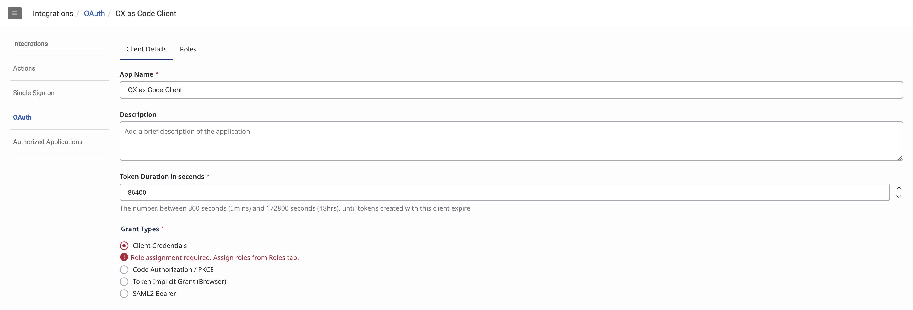


You can then see the Client ID and Client Secret that you will use later.

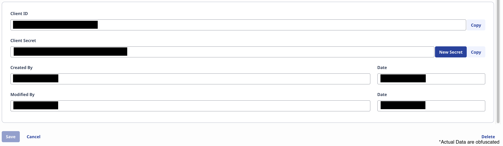

### Clone the blueprint repository

Clone the blueprint repository [webrtc-sdk-blueprint](https://github.com/GenesysCloudBlueprints/webrtc-sdk-blueprint "Goes to the webrtc-sdk-blueprint repository") to your local machine. You can also run this git command to clone the repository:

```bash
git clone https://github.com/GenesysCloudBlueprints/webrtc-sdk-blueprint.git
```

### Setup the Terraform Project

If you haven't installed Terraform yet, installation instructions are provided [here](https://developer.hashicorp.com/terraform/install?product_intent=terraform "Goes to Terraform installation instructions in Hashicorp Developer").

Go to the `provider.tf` file where you can configure the Terraform and the Genesys Cloud Provider. In the `genesyscloud` provider, paste the `Client ID` and `Client Secret` that you just created. Refer to the [Create an OAuth Client](#create-an-oauth-client "Goes to the Create an OAuth Client section") section. You can configure other properties in the Genesys Cloud Provider. For more information on the provider configuration, you can access the [documentation](https://registry.terraform.io/providers/MyPureCloud/genesyscloud/latest/docs "Goes to the Genesys Cloud Provider Documentation in Terraform Registry").

```hcl
terraform {
  required_providers {
    genesyscloud = {
      source  = "mypurecloud/genesyscloud"
      version = "~> 1.59.1" # You may update this to the latest version as needed
    }
  }
}

provider "genesyscloud" {
  oauthclient_id     = "Enter your OAuth Client ID here"
  oauthclient_secret = "Enter your OAuth Client Secret here"

  # Optional parameters that you can configure. You can comment out or remove the parameters that you don't need.

  aws_region   = "Enter your preferred region here"
  access_token = "If you want to use this instead of the OAuth client ID and secret"

  # Gateway Settings
  gateway {
    host     = "gateway.yourhostname.com"
    port     = "443"
    protocol = "https"
    auth {
      username = "Enter your username here"
      password = "Enter your password here"
    }

    path_params {
      path_name  = "Enter your path name here"
      path_value = "Enter your path value here"
    }
  }

  # Proxy Settings
  proxy {
    host     = "proxy.yourhostname.com"
    port     = "443"
    protocol = "https"
    auth {
      username = "Enter your username here"
      password = "Enter your password here"
    }
  }

  # SDK Debug Settings
  sdk_debug           = false
  sdk_debug_file_path = "Enter your debug file path here"
  sdk_debug_format    = "Enter your debug format here"

  # Token Pool Settings
  token_pool_size = 12345
}
```

:::primary Important: It is recommended that sensitive values like Client ID and Client Secret are not stored in your Terraform project. One method to do this is to store these values as an environment variable. For the client ID, use GENESYSCLOUD_OAUTHCLIENT_ID and for client secret, use GENESYSCLOUD_OAUTHCLIENT_SECRET. :::

Once configured, run `terraform init` or `terraform init -upgrade` _(if there's any update to the providers)_ to ensure that the project is ready to run with your configurations.

### Setup and Configure your Terraform Resources

All of the resources needed to create a WebRTC phone are in the `main.tf` file.

#### Create a User

You can create a user using the `genesyscloud_user` resource which looks like this:

```hcl
resource "genesyscloud_user" "sample_user" {
  email = "john@example.com"
  name  = "John Doe"

  # Optional parameters. You can comment out or remove the parameters that you don't need.
  password        = "initial-password"
  division_id     = genesyscloud_auth_division.home.id
  state           = "active"
  department      = "Development"
  title           = "Senior Director"
  manager         = genesyscloud_user.example-user-manager.id
  acd_auto_answer = true
  profile_skills  = ["Java", "Go"]
  certifications  = ["Certified Developer"]
  addresses {
    other_emails {
      address = "john@gmail.com"
      type    = "HOME"
    }
    phone_numbers {
      number     = "+13174181234"
      media_type = "PHONE"
      type       = "MOBILE"
    }
  }
  routing_skills {
    skill_id    = genesyscloud_routing_skill.test-skill.id
    proficiency = 4.5
  }
  routing_languages {
    language_id = genesyscloud_routing_language.english.id
    proficiency = 4
  }
  locations {
    location_id = genesyscloud_location.main-site.id
    notes       = "Office 201"
  }
  employer_info {
    official_name = "Jonathon Doe"
    employee_id   = "12345"
    employee_type = "Full-time"
    date_hire     = "2021-03-18"
  }
  routing_utilization {
    call {
      maximum_capacity = 1
      include_non_acd  = true
    }
    callback {
      maximum_capacity          = 2
      include_non_acd           = false
      interruptible_media_types = ["call", "email"]
    }
    chat {
      maximum_capacity          = 3
      include_non_acd           = false
      interruptible_media_types = ["call"]
    }
    email {
      maximum_capacity          = 2
      include_non_acd           = false
      interruptible_media_types = ["call", "chat"]
    }
    message {
      maximum_capacity          = 4
      include_non_acd           = false
      interruptible_media_types = ["call", "chat"]
    }
    label_utilizations {
      label_id         = genesyscloud_routing_utilization_label.red_label.id
      maximum_capacity = 4
    }
    label_utilizations {
      label_id               = genesyscloud_routing_utilization_label.blue_label.id
      maximum_capacity       = 4
      interrupting_label_ids = [genesyscloud_routing_utilization_label.red_label.id]
    }
  }
}
```

A template is already provided in the `main.tf` file. Additional details of the parameters can be seen [here in the documentation](https://registry.terraform.io/providers/MyPureCloud/genesyscloud/latest/docs/resources/user "Goes to the User resource in the Genesys Cloud Provider Documentation").

#### Create a Location Resource

You can create a location using the `genesyscloud_location` resource which looks like this:

```hcl
resource "genesyscloud_location" "gc_location_samplelocation" {
  name  = "GC Sample Location"
  notes = "A sample location"
  address {
    street1  = "ABC 123 Avenue"
    city     = "Menlo Park"
    state    = "CA"
    country  = "US"
    zip_code = "123456"
  }
  emergency_number {
    number = "1234567890"
    type   = "default"
  }
}
```

A template is already provided in the `main.tf` file. Additional details of the parameters can be seen [here in the documentation](https://registry.terraform.io/providers/MyPureCloud/genesyscloud/latest/docs/resources/location "Goes to the Location resource in the Genesys Cloud Provider Documentation").

#### Create a Site Resource

You can create a site using the `genesyscloud_telephony_providers_edges_site` resource which looks like this:

```hcl
resource "genesyscloud_telephony_providers_edges_site" "gc_site_samplesite" {
  name        = "GC Sample Site"
  location_id = genesyscloud_location.gc_trial_location_locationname.id # or you can manually provide the id of the location
  media_model = "Cloud"

  # Optional parameters. You can comment out or remove the parameters that you don't need.
  media_regions_use_latency_based = true

  edge_auto_update_config {
    time_zone = "America/New_York"
    rrule     = "FREQ=WEEKLY;BYDAY=SU"
    start     = "2021-08-08T08:00:00.000000"
    end       = "2021-08-08T11:00:00.000000"
  }

  number_plans {
    name           = "numberList plan"
    classification = "numberList classification"
    match_type     = "numberList"
    numbers {
      start = "114"
      end   = "115"
    }
  }

  number_plans {
    name           = "digitLength plan"
    classification = "digitLength classification"
    match_type     = "digitLength"
    digit_length {
      start = "6"
      end   = "8"
    }
  }
}
```

A template is already provided in the `main.tf` file. Additional details of the parameters can be seen [here in the documentation](https://registry.terraform.io/providers/MyPureCloud/genesyscloud/latest/docs/resources/telephony_providers_edges_site "Goes to the Site resource in the Genesys Cloud Provider Documentation").

#### Create a WebRTC Phone Base Setting Resource

You can create a site using the `genesyscloud_telephony_providers_edges_phonebasesettings` resource which looks like this:

```hcl
resource "genesyscloud_telephony_providers_edges_phonebasesettings" "gc_phonebasesettings_webrtc_samplesetting" {
  name               = "GC Example WebRTC Phone Base Settings"
  description        = "GC Example WebRTC Phone Base Settings"
  phone_meta_base_id = "inin_webrtc_softphone.json" # The make and model of the phone. The given is the PureCloud WebRTC Phone/Genesys Cloud WebRTC Phone.

  # Optional parameters. You can comment out or remove the parameters that you don't need.
  properties = jsonencode({
    "phone_label" = {
      "value" = {
        "instance" = "PureCloud WebRTC Phone"
      }
    },
    "phone_maxLineKeys" = {
      "value" = {
        "instance" = 1
      }
    },
    "phone_media_codecs" = {
      "value" = {
        "instance" = [
          "audio/opus"
        ]
      }
    },
    "phone_media_dscp" = {
      "value" = {
        "instance" = 46
      }
    },
    "phone_sip_dscp" = {
      "value" = {
        "instance" = 24
      }
    }
  })
  capabilities {
    registers             = false
    provisions            = false
    dual_registers        = false
    no_cloud_provisioning = false
    allow_reboot          = false
    hardware_id_type      = "mac"
    no_rebalance          = false
    media_codecs = [
      "audio/opus"
    ]
    cdm = true
  }
}
```

A template is already provided in the `main.tf` file. Additional details of the parameters can be seen [here in the documentation](https://registry.terraform.io/providers/MyPureCloud/genesyscloud/latest/docs/resources/telephony_providers_edges_phonebasesettings "Goes to the Phone Base Setting resource in the Genesys Cloud Provider Documentation").

#### Create a Phone Resource to a specific user

You can create a site using the `genesyscloud_telephony_providers_edges_phone` resource which looks like this:

```hcl
resource "genesyscloud_telephony_providers_edges_phone" "gc_webrtcphone_sampleuser" {
  name                   = "GC WebRTC Phone Example User"
  state                  = "active"
  site_id                = genesyscloud_telephony_providers_edges_site.gc_site_samplesite.id                                     # or manually provide the site ID
  web_rtc_user_id        = genesyscloud_user.sample_user.id                                                                      # or manually provide the user ID
  phone_base_settings_id = genesyscloud_telephony_providers_edges_phonebasesettings.gc_phonebasesettings_webrtc_samplesetting.id # or manually provide the phone base settings ID

  # Other optional parameters. You can comment out or remove the parameters that you don't need.
  line_base_settings_id = data.genesyscloud_telephony_providers_edges_linebasesettings.line-base-settings.id
  phone_meta_base_id    = "inin_webrtc_softphone.json"
  properties            = "{}"

  line_properties {
    line_address = ["+10123456789"]
  }

  capabilities {
    provisions            = false
    registers             = false
    dual_registers        = false
    allow_reboot          = false
    no_rebalance          = false
    no_cloud_provisioning = false
    cdm                   = true
    hardware_id_type      = "mac"
    media_codecs          = ["audio/opus"]
  }
}
```

A template is already provided in the `main.tf` file. Additional details of the parameters can be seen [here in the documentation](https://registry.terraform.io/providers/MyPureCloud/genesyscloud/latest/docs/resources/telephony_providers_edges_phone "Goes to the Phone resource in the Genesys Cloud Provider Documentation").

### Deploy your Terraform Resources

Once you have your resources declared in the Terraform project, run `terraform plan` to validate. It takes into account all the Terraform configuration files and identifies any syntax errors, version mismatch errors, etc. It also checks the code to identify and highlight resources that will be created, updated, or deleted if we choose to execute the current version of the code. This process provides a useful snapshot of changes before applying them to the target infrastructure.

Once you review your changes and have no errors, run `terraform apply` to deploy.

## Testing

You can inspect in the Genesys Cloud if the WebRTC phone we created is provisioned to the specific user. You can test it by logging in as that user and select the WebRTC Phone you have just created. On Genesys Cloud, go to **Calls** (from the side navbar) > **Phone Details** Tab > **Your Device For Calls** Dropdown > **Select Phone**.

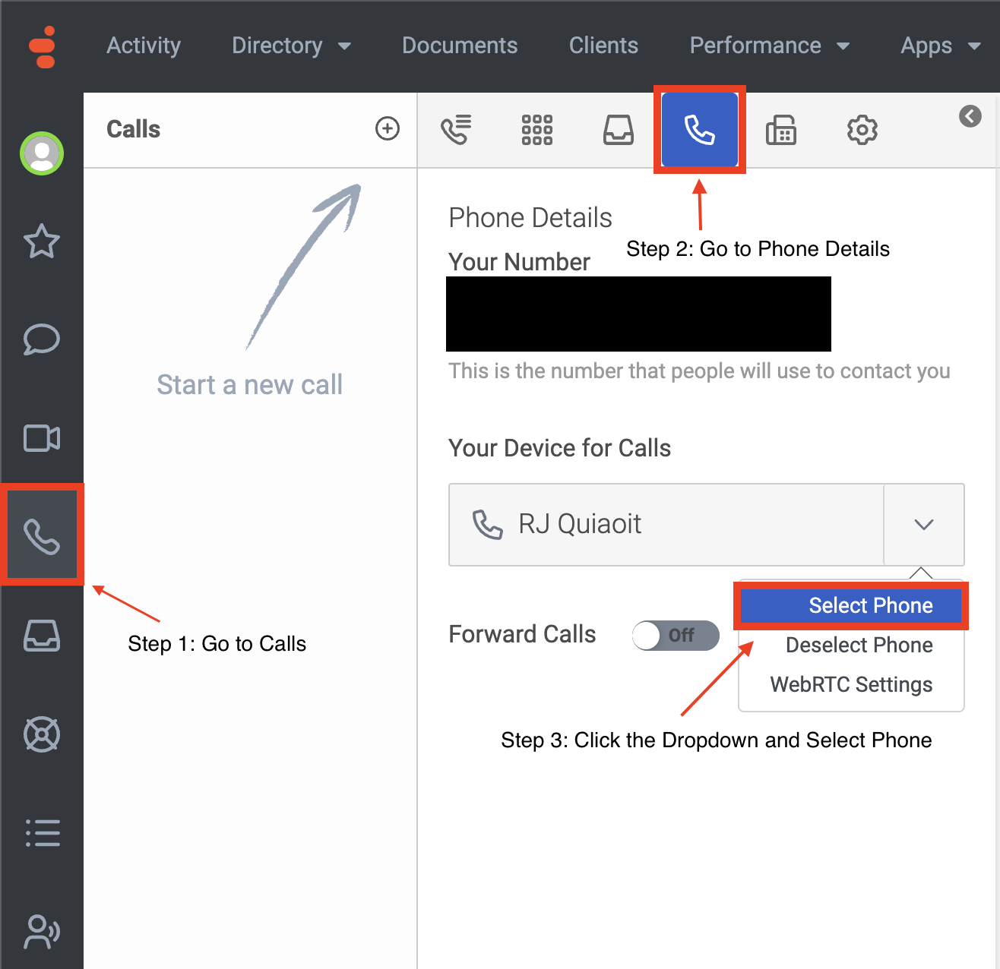

## Additional Resources

- [About WebRTC](https://help.mypurecloud.com/articles/about-genesys-cloud-webrtc-phones/ "Goes to the About WebRTC article in the Genesys Cloud Resource Center")
- [WebRTC call flow](https://help.mypurecloud.com/articles/webrtc-call-flow/ "Goes to the WebRTC call flow article in the Genesys Cloud Resource Center")
- [Detailed WebRTC diagram](https://help.mypurecloud.com/articles/detailed-webrtc-diagram/ "Goes to the Detailed WebRTC diagram article in the Genesys Cloud Resource Center")
- [Introducing CX as Code](/blog/2021-04-16-cx-as-code/ "Goes to the Introducing CX as Code blog by John Carnell in the Genesys Cloud Developer Center")
- [Genesys Cloud Provider Documentation](https://registry.terraform.io/providers/MyPureCloud/genesyscloud/latest/docs "Goes to the Genesys Cloud Provider Documentation in Terraform Registry")
